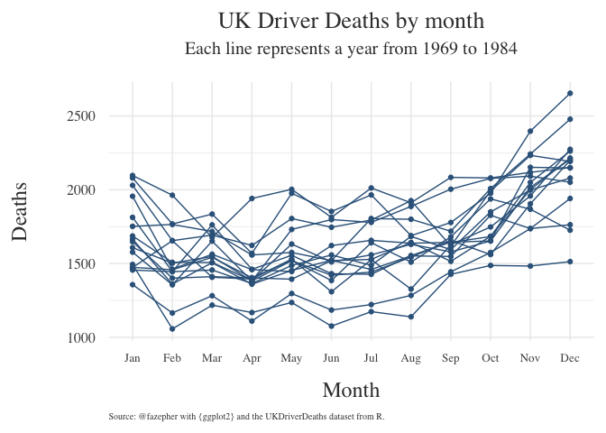
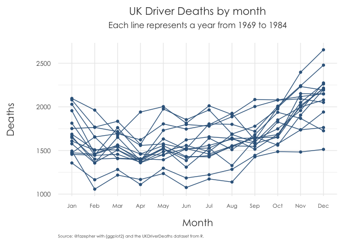
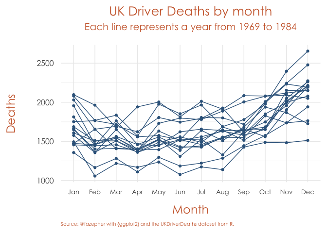

<!-- README.md is generated from README.Rmd. Please edit that file -->

# fazhthemes

<!-- badges: start -->

<!-- badges: end -->

The goal of fazhthemes is to contain my personal {ggplot2} themes.

## Installation

You can install the development version of {fazhthemes} from
[GitHub](https://github.com/) with:

``` r
# install.packages("devtools")
devtools::install_github("fazepher/fazhthemes")
```

## Example

Let’s begin with some data already available in R.

``` r
library(fazhthemes)
#> Loading required package: ggplot2
library(tidyverse)
#> ── Attaching packages ─────────────────────────────────────────────────────────────── tidyverse 1.3.0 ──
#> ✓ tibble  3.0.3     ✓ dplyr   1.0.0
#> ✓ tidyr   1.1.0     ✓ stringr 1.4.0
#> ✓ readr   1.3.1     ✓ forcats 0.5.0
#> ✓ purrr   0.3.4
#> Warning: package 'tibble' was built under R version 4.0.2
#> ── Conflicts ────────────────────────────────────────────────────────────────── tidyverse_conflicts() ──
#> x dplyr::filter() masks stats::filter()
#> x dplyr::lag()    masks stats::lag()

UKDriverDeaths_tibble <- UKDriverDeaths %>%
  matrix(nrow=16, ncol=12, byrow = TRUE,
         dimnames = list(1969:1984,month.abb)) %>%
  as.data.frame() %>%
  rownames_to_column("Year") %>% 
  pivot_longer(-Year,names_to = "Month", values_to = "Deaths") %>% 
  mutate(Month = factor(Month,levels = month.abb,ordered = TRUE))

head(UKDriverDeaths_tibble)
#> # A tibble: 6 x 3
#>   Year  Month Deaths
#>   <chr> <ord>  <dbl>
#> 1 1969  Jan     1687
#> 2 1969  Feb     1508
#> 3 1969  Mar     1507
#> 4 1969  Apr     1385
#> 5 1969  May     1632
#> 6 1969  Jun     1511
tail(UKDriverDeaths_tibble)
#> # A tibble: 6 x 3
#>   Year  Month Deaths
#>   <chr> <ord>  <dbl>
#> 1 1984  Jul     1222
#> 2 1984  Aug     1284
#> 3 1984  Sep     1444
#> 4 1984  Oct     1575
#> 5 1984  Nov     1737
#> 6 1984  Dec     1763
```

We can explore the monthly driver deaths in the UK for each year in our
dataset. From the core themes, I’ve always prefered minimal, so let’s
see it. It looks good.

``` r
uk_dd_plot <- ggplot(data = UKDriverDeaths_tibble, aes(x=Month,y=Deaths,group=Year)) +
  geom_line(color = "steelblue4") +
  geom_point(color = "steelblue4") +
  labs(title = "UK Driver Deaths by month", 
       subtitle = "Each line represents a year from 1969 to 1984", 
       caption = "Source: @fazepher with {ggplot2} and the UKDriverDeaths dataset from R.") 

uk_dd_plot + 
  theme_minimal()
```


However, I’m not a fan of several things. First, at work, we mostly use
gray texts in our presentations instead of the default black in the
plot. Secondly, we never liked the title and subtitles on the left.
Thirdly, our corporate prefered font is more similar to the Century
Gothic family. So I frequently ended up changing {ggplot2}’s defaults.
Furthermore, when working on reports for clients, my coworker Lucía
always noted that the axis texts and titles were too small on the actual
reports. As she constantly needed to adjust them, and we knew her
changes would almost surely result in better plots, it soon became an
inside joke: now, let’s *lucify* the plot. We worked together in order
to come up with some other defaults that we felt were appropriate for
those needs (and our aesthetic tastes). The result were the *lucified*
core themes. How do they look? Let’s lucify our previous plot\!

``` r
uk_dd_plot + 
  lucify_theme_minimal() 
```


Obviously, like I said, these themes are tailored to our own specific
aesthetics. You may not like to change the default family font or want
to use your own prefered family (you could also have an error when
trying to use Century Gothic, probably because in order to change
families in plots, one has to first use the {extrafont} package). You
can always change the family with another call, for example adding
theme(text = element\_text(family = “serif”)), but the lucify theme
functions allow you to specify it directly with the text\_family
argument.

``` r
uk_dd_plot + 
  lucify_theme_minimal(text_family = "serif") 
```



Likewise, if you feel we have chosen too big text sizes you can scale
back with the text\_size argument.

``` r
uk_dd_plot + 
  lucify_theme_minimal(text_size = 12) 
```



Lastly, there is a text\_color argument. This feature is still in
development, in terms of its interaction with the different themes.
Currently, for the lucified minimal theme it doesn´t change the axis
text color, for example.

``` r
uk_dd_plot + 
  lucify_theme_minimal(text_color = "sienna3") 
```


