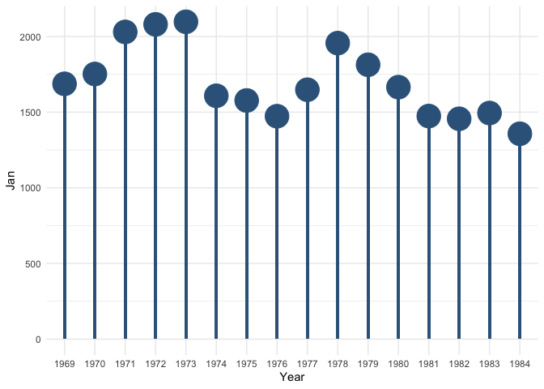

<!-- README.md is generated from README.Rmd. Please edit that file -->

# fazhthemes

<!-- badges: start -->

<!-- badges: end -->

The goal of fazhthemes is to …

## Installation

You can install the development version of fazhthemes from
[GitHub](https://github.com/) with:

``` r
# install.packages("devtools")
devtools::install_github("fazepher/fazhthemes")
```

## Example

I have found the core themes of {ggplot2} to have small text sizes. I
also like more the Century Gothic family font. So we can edit both, as
well as some other features, by “lucifying” a core theme.

``` r
library(fazhthemes)
library(tidyverse)
#> ── Attaching packages ─────────────────────────────────────────────────────────────── tidyverse 1.3.0 ──
#> ✓ ggplot2 3.3.2     ✓ purrr   0.3.4
#> ✓ tibble  3.0.3     ✓ dplyr   1.0.0
#> ✓ tidyr   1.1.0     ✓ stringr 1.4.0
#> ✓ readr   1.3.1     ✓ forcats 0.5.0
#> Warning: package 'ggplot2' was built under R version 4.0.2
#> Warning: package 'tibble' was built under R version 4.0.2
#> ── Conflicts ────────────────────────────────────────────────────────────────── tidyverse_conflicts() ──
#> x dplyr::filter() masks stats::filter()
#> x dplyr::lag()    masks stats::lag()

UKDriverDeaths_tibble <- UKDriverDeaths %>%
  matrix(nrow=16, ncol=12, byrow = TRUE,
         dimnames = list(1969:1984,month.abb)) %>%
  as.data.frame() %>%
  rownames_to_column("Month")

ggplot(data = UKDriverDeaths_tibble, aes(x=Month,y=Jan)) +
  geom_col(fill = "steelblue4", width = 0.1) +
  geom_point(color = "steelblue4", size = ggplot2::rel(10)) +
  theme_minimal()
```



``` r
ggplot(data = UKDriverDeaths_tibble, aes(x=Month,y=Jan)) +
  geom_col(fill = "steelblue4", width = 0.1) +
  geom_point(color = "steelblue4", size = ggplot2::rel(10)) +
  theme_minimal() +
  lucify_basics()
```


